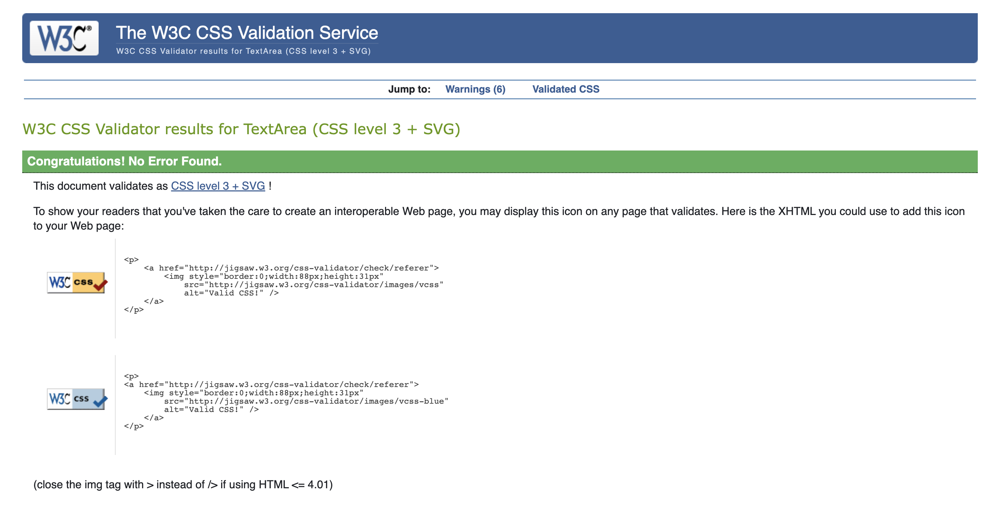

<!--Heading & logo-->
## To DOs App

[App Preview](https://ngonidukemoyo-dukeonline-wfxfj3hkd6m.ws-eu33.gitpod.io/)

## Build 
Gitpod work environment

## Purpose
This is an ecommerce website which caters to the exchange of goods and services for electronic transaction.

<!--UX & User stories-->
# User Experience
Shopper | I want to be able to | So that i can |
         Viewing & Navigation
 Shopper 1 | view a list of products | select some to buy|
 Shopper 2 | view individual products details | See price, details, description, rating |
 Shopeer 3 | quickly identify deals, specials | special offer savings |
 Shopper 4 | easily view total of my purchase at any time | avoid spending too much |
            Registration & user account
Site User 5 | easily register an account | have a personalised account |
Site User 6 | easily login and logout | acess personal account | 
Site User 7 | easily recover password | recover access |
Site User 8 | receive email after registration | verify account registration success |
Site User 9 | have a personalized profile | order history and other confirmation and saved payment information |
             Sorting & Searching 
Shopper 10  | sort the list of available products | easily identify best rates, prices and category sorting|
Shopper 11 | sort specific category product | find the best price across broad categoty |
Shopper 12 | sort multiple categories of products | find best price accross broad category |
Shopper 13 | search for product by name or description | find a specific product |
Shopper 14 | easily see what i have searched and number of results | quickly describe whether the product is available |
            Purchasing & check out
Shopper 15 | easily select size and quantity when buying | ensure i dont select the wrong product |
Shopper 16 | view items in my bag to be purchased | identify the total cost of my purchase and all items to be received |
Shopper 17 | adjust the quanitty of individual items in my bag | easily make changes before check out |
Shopper 18 | easily enter payment info | check out quick and easy |
Shopper 19 | feel my personal info is safe | comfortably provide the needed info for purchase |
Shopper 20 | view an order confirmation after checkout | verify that i havent made mistakes |
Shopper 21 | receive an email confirmation after checking out | keep the confirmation of purchased items for records |
            Admin & store management
Store Owner | add a product | add new items to the store |
Store Owner | edit or update a product | change product prices, descriptions, images aand other criteria |
Store Owner | delete products | remove items that no longer for sale |

### Technologies

## Languages
1. HTML
2. CSS
3. Python
4. JSON
5. JavaScript

<!--Main Versions Requirements used in project-->
# Versions
## Django 3.2 
## Django Allauth 0.41.0

# Installation 
## pip3 install Django==3.2
## pip3 django-allauth==0.41.0
## pip3 install pillow 9.0.1
## pip3 install django-crispy-forms 1.14.0
## pip3 install stripe
## pip3 install django-countries 7.2.1
## pip3 install dj_database_url
## pip3 install psycopg2-binary
## pip3 install gunicorn

<!--Requirements-->
# Projects Requirements
## asgiref==3.5.0
## backports.zoneinfo==0.2.1
## Django==3.2
## django-allauth==0.41.0
## oauthlib==3.1.1
## python3-openid==3.2.0
## pytz==2021.3
## requests-oauthlib==1.3.0
## sqlparse==0.4.2

### Testing
CSS base temp Validator 
CSS profile temp Validator 
CSS checkout temp Validator 
HTML Validator 
HTML Validator 
HTML Validator 

<!--Design-->
# Color Scheme
The color scheme is more aimed at lighter colors to grab the interest and attention. There are a lot of whites, light blue and stanaderd back to contrast with the white.

<!--features-->

# Testing 
1. A large amount of testing was done to ensure that all libraries are still appearing in the app as they kept on removing themselves.
Friends and family members were asked to review the site and documentation to point out any bugs and/or user experience issues

# Further Testing
family and friends

# Performance Testing Test Cases
# Usability Testing Test Cases
# Compatibility Testing
# Browser Testing

# Bugs
1. Initially downloading django 4 but turns out it was not the appropriate version therefore some documentation was hard wired in the coge which cause the requirements like :
## pip3 install Django==3.2
## pip3 django-allauth==0.41.0
## pip3 install pillow 9.0.1
## pip3 install django-crispy-forms 1.14.0
## pip3 install stripe
## pip3 install django-countries 7.2.1
to be reinstalled before running the app.

# Deployment
## Heroku
 1. The heroku create CLI command creates a new empty application on Heroku, along with an associated empty Git repository. If you run this command from your app’s root directory, the empty Heroku Git repository is automatically set as a remote for your local repository.

heroku create -a example-app
Creating app... done, ⬢ example-app
https://thawing-inlet-61413.herokuapp.com/ | https://git.heroku.com/example-app.git
You can use the git remote command to confirm that a remote named heroku has been set for your app:

git remote -v
heroku  https://git.heroku.com/example-app.git (fetch)
heroku  https://git.heroku.com/example-app.git (push)

Git installation instructions

Heroku CLI installation instructions

Before you can deploy your app to Heroku, initialize a local Git repository and commit your application code to it.

  #### Credits
  1. Code Institute Materials

  ## Content 
  1. Content was created by developer

  ## Images
  1. Images created by developer

  ## Media
  1. My Mentor for continuous helpful feedback and google for continuous research.
# code

# content
Content was created by developer
# Media
Images created by developer

# Acknowledgements
My Mentor for continuous helpful feedback and google for continuous research

<!--Challenges faced in Project-->
  # challenges
  The reinstallment of all requirements everytime after closing the environment

